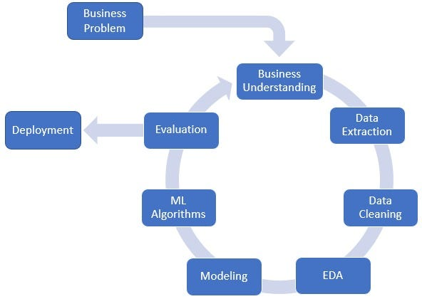

### Planejamento do Projeto

Metodologia de projeto aplicando o CRISP-DM adaptado para contextos de ciência de dados. 

**1. Output (Saída)**:
- API com um modelo capaz de realizar classificações multiclasse, identificando uma ou mais categorias para cada frase. As categorias serão representadas por tags (por exemplo, "esportes", "finanças"), podendo ser atribuídas múltiplas tags a uma única frase.

**2. Input (Entrada)**:
- Dados com duas colunas: uma contendo as frases e a outra os rótulos de classificação. Os rótulos podem ser únicos ou múltiplos (separados por vírgula) para cada frase.

**3. Processos**:
- **Limpeza de Ruídos**: Remoção de caracteres especiais, números desnecessários ou erros de digitação que não contribuem para o significado das frases.
- **Tratamento de Texto**: Aplicação de técnicas como tokenização, remoção de stopwords, e lemmatization para normalizar o texto.
- **Transformação dos Rótulos**: Transformar a coluna de classificação em múltiplas colunas binárias, uma para cada categoria possível (One-Hot Encoding), para representar a presença ou ausência de cada categoria em uma frase.
    1. **Separar as Categorias**: Primeiro, separar as categorias que estão na mesma célula, mas divididas por vírgula. É possível transformar cada célula em uma lista de categorias.
    2. **One-Hot Encoding**: Em seguida, transformar essas categorias em um formato binário, onde cada coluna representa uma possível categoria e cada linha tem um 1 ou 0, indicando a presença ou ausência dessa categoria. Potenciais escolhas são Pandas com a função `get_dummies` ou `MultiLabelBinarizer` do `sklearn.preprocessing` para lidar com múltiplos rótulos.
- **Divisão do Conjunto de Dados**: Separar o conjunto de dados em treinamento, validação, e teste.
- **Word Embedding**: Utilizar técnicas de embedding para converter tokens em vetores numéricos que representem seu significado.
- **Escolha do Modelo**: Experimentar com diferentes arquiteturas de Deep Learning.

### Modelos de Deep Learning Sugeridos

- **Redes Neurais Recorrentes (RNN)**: Úteis para processamento de sequências, como texto.
- **LSTM (Long Short-Term Memory)**: Uma variante de RNN que lida melhor com dependências de longo prazo.
- **GRU (Gated Recurrent Units)**: Similar à LSTM, mas mais simples e, em alguns casos, mais eficiente.
- **CNN (Convolutional Neural Networks) para Texto**: Embora mais conhecidas por aplicações em imagens, as CNNs podem ser eficazes para capturar padrões locais em texto.
- **Fine-tuning de Modelos Pré-treinados**: Aproveitar modelos de linguagem pré-treinados e ajustá-los aos seus dados pode melhorar significativamente o desempenho.
- **Regularização**: Aplicar técnicas como dropout para evitar overfitting, especialmente útil em conjuntos de dados pequenos.

### Entrega e Integração com JavaScript

- **API em Python**: Utilizar frameworks como Flask ou FastAPI para criar uma API RESTful que recebe frases como entrada e retorna as categorias preditas.
- **Containerização com Docker**: Containerizar sua aplicação Python em uma imagem Docker, facilitando o deploy e a execução em diferentes ambientes.
- **Chamada da API no JavaScript**: Utilizar o Fetch API ou bibliotecas como Axios no seu projeto JavaScript para realizar requisições HTTP à API Python. Você pode expor sua API Python por meio de um serviço de nuvem (AWS, GCP, Azure) ou um servidor local, dependendo das necessidades.

### Melhorias e Sugestões

- **Data Augmentation**: Aumentar o conjunto de dados gerando novas frases a partir das existentes pode ajudar a combater o underfitting e melhorar a generalização.
- **Transformers**: Modelos baseados em atenção, como o BERT, são muito eficientes para entender contextos e relações complexas em texto.
